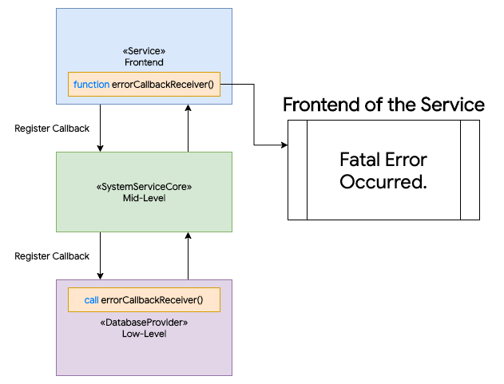

# ChatApp
A PHP-Based Simple Chat Web App.


# Environments

Tested on `Apache 2.4.43`

- `PHP 7.2.31`
- `MySQL`
- No dependencies with any other packages.

# Implementation of HttpRequest

What I thought is that, could I make this more simpler?

```php
if (isset($_POST['trigger_query'])) {
  // Request processes...
}
```

This implementation is quite simple, but it could make a source complicated, and less-legibility.  
So I've implemented a simple class that provides HttpRequest-Handling more easily, and reliable.  
It'll look like:

```php
/* Parameters: Method, TriggerQuery, Callback-Function */

// Execute the function in a specific namespace,
// if the query 'login' is executed. with the HTTP_POST.
HTTP_HANDLER\RegisterHttpRequestHandler(HTTP_POST, 'login', 'APP\ExecAuthenticate');

// We can execute anonymous function as well.
HTTP_HANDLER\RegisterHttpRequestHandler(HTTP_POST, 'login', function() {
  echo ('Are you tryna login?');
});
```

Very easy, good-looks.

# Implementation of Errors and Exceptions Handling

This is how the system handles fatal exceptions/errors at the low-level.

```php
// This function must be called at anytime, anywhere.
function errorCallbackReceiver() {
  echo('Fatal error occurred, Please try again later.');
}

class ServiceCore {
  function __construct(... $callbackFunc) {
    // Pass it to the another provider.
    $low_level_impl = new LowLevelImpl(... $callbackFunc);
  }
}
```



# Implementation of Chatting

The implementation of chatting is quite simple.

## Send Chat

Store the message context with the sender and recipient names.

```php
$queryString = "INSERT INTO `chats`
(`sender`, `recipient`, `context`)
VALUES
('$this->selfName', '$this->recipientName', '$message')";

$queryResult = $this->db->IssueQuery($queryString);
```

## Receive Incoming Chats

Simply `select` the chats sorting by `datetime`.

```php
$queryString = "SELECT * FROM `chats`
WHERE
(`sender`='$this->recipientName' AND `recipient`='$this->selfName')
OR
(`sender`='$this->selfName' AND `recipient`='$this->recipientName')
ORDER BY `datetime`
LIMIT $numberOfMessages";

$queryResult = $this->db->IssueQuery($queryString);
```

## Database Schema

### Columns
- `sender` `TEXT(64)` # sender of the message
- `recipient` `TEXT(64)` # recipient of the message
- `context` `TEXT(1024)` # context of the message, maximum 1024 characters accepted.
- `datetime` `DATETIME` `CURRENT_TIMESTAMP()` # shows that when the message context created
- `readed` `TINYINT` # shows that the message got readed or not. as boolean(1 true or zero false)

# About The Security

Secruity features are incomplete since this is not for public.
